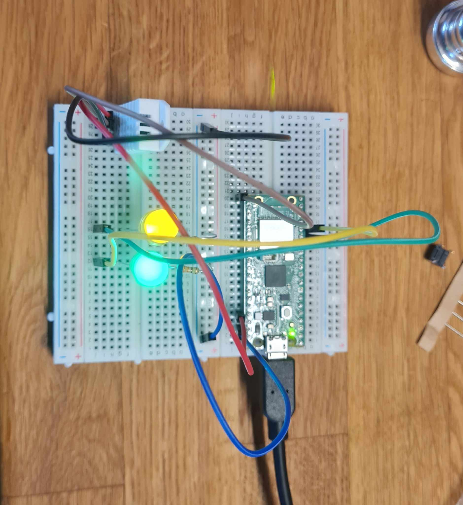
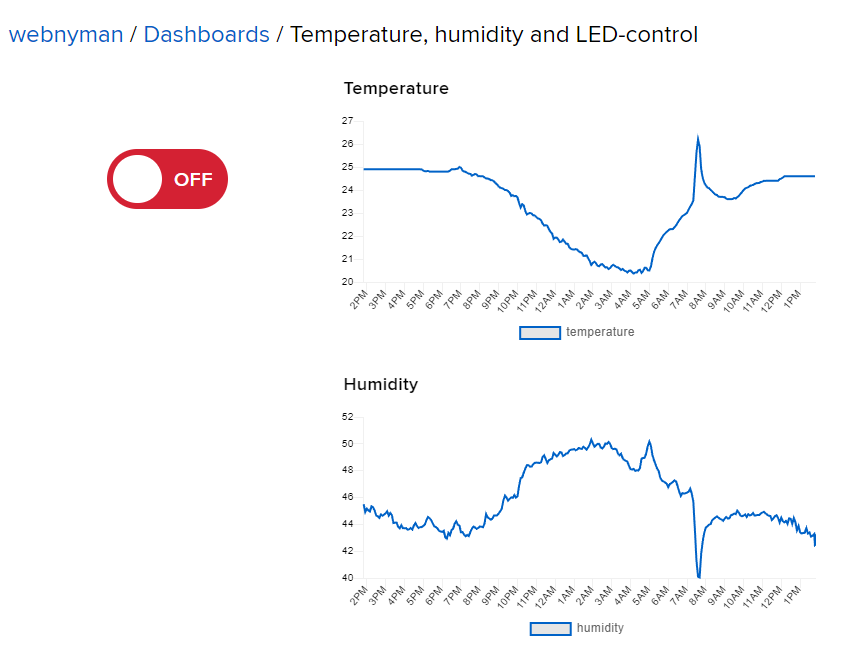

# Report 1dv027 Assignment IOT

## Tutorial on how to build a temperature and humidity sensor

### Assignment IOT - A temperature and humidity sensor with two leds
Name: Björn Nyman, bn222eg

#### Project Overview
This project showcases the integration of the Raspberry Pi Pico W with Adafruit IO to create a comprehensive IoT solution for environmental monitoring and remote device control. It provides practical insights into real-time data monitoring, remote control via IoT platforms, and efficient data communication using MQTT.

Time spent: 20 hours

### Objective

I choose to build a device that met the basic demands of the course due to high workload in another course.

#### Purpose
The primary purpose of this project is to monitor environmental conditions (temperature and humidity) remotely and provide a simple way to control an LED through an IoT platform. This system can be used in various applications, including home automation, greenhouse monitoring, and server room environmental management.

#### Insights
The project provides insights into:

Real-Time Monitoring: Track temperature and humidity in real-time from any location.
Remote Control: Use the Adafruit IO dashboard to control physical devices (LED) remotely.
IoT Integration: Demonstrates how to integrate sensors and actuators with an IoT platform using MQTT.

### Material

#### List of material

| Item | Description |
| ---- | ----------- |
| Raspberry PI Pico W | The "brain" in the device. Has built-in Wifi. |
| 1 Green 5mm LED | LED that I use for the sensors activity. |
| 1 Yellow 5mm LED | LED that I use for the wifi connection. |
| 2 330 Ohm Resistors | Used for the LED´s. |
| Male to Male Jumper Wires | Connects the components with the Pico. |
| USB-cable | Connects w. the computer and the power source. |
| Temp/Humidity Sensor RHT03 | A Sensor that measures temp and humidity |

I bought all the components from Electro:kit and hte cost was 464 SEK.



### Computer setup

#### Setting the device up with my IDE
1. I connected the pico to my breadboard and connected the pico to my computer which appeared as a "device" on my computer
2. I downloaded the MicrPython firmware from the MicrPython downloads page
3. I copied (flashed) the firmware to my pico
4. I rebooted the pico by holding the BOOTSEL button down and reconnected the pico with my conmputer
5. I started VSCode which already had Python installed
6. I installed MicroPico from my Extensions in VSCode
7. I connected my Pico to my VSCode through the MicroPico Device Controller
8. I cloned the project from Gitlab and opened a new folder in VSCOde
9. Through the MicroPico Device controller I could now see both my local repo and the device folder. I could now easily transfer files between the project and the device.
10. You code in your IDE and then you could either run them directly from your ide or transfer the files to your device and run them from there.

### TODO: Putting everything together

How is all the electronics connected? Describe all the wiring. Good if you can show a circuit diagram. Be specific on how to connect everything and what to think of in terms of resistors, current, and voltage. Is this only for a development setup, or could it be used in production?

- [ ] Circuit diagram (can be hand drawn)
- [ ] *Electrical calculations

### Platform

Describe your choice of platform. If you have tried different platforms, it can be good to provide a comparison.

Is your platform based on a local installation or a cloud? Do you plan to use a paid subscription or a free one? Describe the alternatives going forward if you want to scale your idea.

- [ ] Describe platform in terms of functionality
- [ ] *Explain and elaborate on what made you choose this platform

### The code

1. Setting Up the Network
The WifiManager class is responsible for connecting the Raspberry Pi Pico W to a WiFi network. This class handles the connection process and provides feedback via an LED.

Code Snippet:

```python
import network
import time
from machine import Pin

class WifiManager:
    def __init__(self, ssid, password, led_pin=11):
        self.ssid = ssid
        self.password = password
        self.wlan = network.WLAN(network.STA_IF)
        self.wlan.active(True)
        self.led = Pin(led_pin, Pin.OUT)
        self.led.value(0)  # Ensure LED is off initially

    def connect(self):
        self.wlan.connect(self.ssid, self.password)
        wait = 10
        while wait > 0:
            if self.wlan.status() < 0 or self.wlan.status() >= 3:
                break
            wait -= 1
            print('waiting for connection...')
            self.blink_led()
            time.sleep(1)

        if self.wlan.status() != 3:
            self.led.value(0)  # Turn off LED
            raise RuntimeError('WiFi connection failed')
        else:
            self.led.value(1)  # Turn on LED
            print('connected')
            ip = self.wlan.ifconfig()[0]
            print('network config:', ip)
            return ip

    def blink_led(self):
        self.led.value(1)  # LED ON
        time.sleep(0.5)
        self.led.value(0)  # LED OFF
        time.sleep(0.5)
```
Explanation:

- The __init__ method initializes the WiFi credentials and sets up an LED to indicate connection status.
- The connect method attempts to connect to the WiFi network and provides visual feedback using the LED.
- The blink_led method is used to blink the LED during the connection process.

2. Reading Sensor Data
The Sensor class reads temperature and humidity data from the DHT22 sensor. This class abstracts the sensor's data collection process.

Code Snippet:

```python
Kopiera kod
import dht
from machine import Pin

class Sensor:
    def __init__(self, dht_pin=16, led_pin=17):
        self.dht_sensor = dht.DHT22(Pin(dht_pin, Pin.IN, Pin.PULL_UP))
        self.led = Pin(led_pin, Pin.OUT)
        self.led.value(0)  # Ensure LED is off initially

    def read(self):
        try:
            self.dht_sensor.measure()  # Measure the data
            temperature = self.dht_sensor.temperature()  # Get the temperature in Celsius
            humidity = self.dht_sensor.humidity()  # Get the humidity
            self.led.value(1)  # Turn on LED to indicate success
            data = {
                "temperature": temperature,
                "humidity": humidity
            }
            return data  # Return data as a dictionary
        except OSError as e:
            print('Failed to read sensor.')
            self.led.value(0)  # Turn off LED to indicate failure
            return None
```
Explanation:

- The __init__ method initializes the DHT22 sensor on the specified GPIO pin.
- The read method reads the temperature and humidity from the sensor and returns the data as json.

3. Publishing Data via MQTT
The MQTTClientWrapper class handles the connection to the MQTT broker and the publishing of sensor data.

Code Snippet:

```python
from umqtt.simple import MQTTClient

class MQTTClientWrapper:
    def __init__(self, client_id, server, port, user, password):
        self.client = MQTTClient(client_id, server, user=user, password=password, port=port)
        self.client.connect()

    def set_callback(self, callback):
        self.client.set_callback(callback)

    def subscribe(self, topic):
        self.client.subscribe(topic)

    def publish(self, topic, msg):
        self.client.publish(topic, msg)

    def check_msg(self):
        self.client.check_msg()

    def disconnect(self):
        self.client.disconnect()
```
Explanation:

- The __init__ method initializes the MQTT client and connects to the MQTT broker.
- The set_callback method sets the callback function for incoming messages.
- The subscribe method subscribes to a specified MQTT topic.
- The publish method publishes a message to a specified MQTT topic.
- The check_msg method checks for incoming MQTT messages.
- The disconnect method disconnects the client from the MQTT broker.

4. Main Script Integration
The main script integrates these classes to create a complete application that connects to WiFi, reads sensor data, publishes data to Adafruit IO, and handles remote control commands.

Code Snippet:

```python
import config
from WifiManager import WifiManager
from Sensor import Sensor
from MQTTManager import MQTTClientWrapper
import time
import gc
from machine import Pin

# Callback function to handle messages
def mqtt_callback(topic, msg):
    message = msg.decode("utf-8")
    print("Received message: {} on topic: {}".format(message, topic))
    if message == "ON":
        led.value(1)
    elif message == "OFF":
        led.value(0)

def main():
    gc.collect()  # Run garbage collection to free up memory

    # Initialize WiFi manager and connect to WiFi
    wifi_manager = WifiManager(config.WIFI_SSID, config.WIFI_PASSWORD)
    try:
        wifi_manager.connect()
    except RuntimeError as e:
        print("WiFi connection failed:", e)
        return

    # WiFi is connected, set the WiFi LED to on
    wifi_manager.led.value(1)
    print("Network config:", wifi_manager.wlan.ifconfig())

    # Delay to ensure WiFi connection is stable
    time.sleep(5)

    # Initialize the MQTT client
    mqtt_client = MQTTClientWrapper(
        client_id="pico",
        server="io.adafruit.com",
        port=1883,
        user=config.AIO_USERNAME,
        password=config.AIO_KEY
    )

    mqtt_client.set_callback(mqtt_callback)
    mqtt_client.subscribe("{}/feeds/led-control".format(config.AIO_USERNAME))

    global led
    led = Pin("LED", Pin.OUT)  # Initialize the built-in LED pin
    green_led = Pin(12, Pin.OUT)  # Initialize the green LED pin

    # Set up a timer to control the sensor data publishing interval
    last_publish_time = time.time()
    publish_interval = 5  # Time interval in seconds

    sensor = Sensor()  # Initialize the sensor after setting up WiFi and MQTT

    try:
        while True:
            current_time = time.time()

            # Check if it's time to publish sensor data
            if current_time - last_publish_time >= publish_interval:
                sensor_data = sensor.read()
                if sensor_data:
                    temperature = sensor_data["temperature"]
                    humidity = sensor_data["humidity"]

                    # Publish temperature and humidity to their respective feeds
                    print(f'Publishing temperature: {temperature}')
                    mqtt_client.publish("{}/feeds/temperature".format(config.AIO_USERNAME), str(temperature))
                    
                    print(f'Publishing humidity: {humidity}')
                    mqtt_client.publish("{}/feeds/humidity".format(config.AIO_USERNAME), str(humidity))
                    
                    last_publish_time = current_time
                    green_led.value(1)  # Turn on green LED to indicate success
                else:
                    print("Failed to read from the sensor")
                    green_led.value(0)  # Turn off green LED to indicate failure

            # Check for incoming messages
            mqtt_client.check_msg()
                
            time.sleep(0.1)  # Short sleep to prevent 100% CPU usage

    except Exception as e:
        print("Exception:", e)
        while True:
            wifi_manager.blink_led()  # Indicate error state by blinking WiFi LED

if __name__ == "__main__":
    main()
```
Explanation:

- The main function initializes the WiFi connection, sets up the MQTT client, and reads sensor data at regular intervals.
- The mqtt_callback function handles incoming MQTT messages to control the LED.
- The script uses garbage collection (gc.collect()) to manage memory usage effectively.

### Data flow / Connectivity
This IoT application collects temperature and humidity data from a DHT22 sensor connected to a Raspberry Pi Pico W and transmits this data to the Adafruit IO platform over the internet. Additionally, it allows remote control of an LED via the Adafruit IO dashboard.

#### Data Transmission
1. Sensor Data Collection:

- The DHT22 sensor connected to the Raspberry Pi Pico W reads temperature and humidity data.
- This data is collected and formatted as a JSON object in the application.
2. Data Transmission to the Internet:

- The data is transmitted to Adafruit IO using WiFi and MQTT protocols.
- The Raspberry Pi Pico W connects to a WiFi network and publishes the sensor data to Adafruit IO at regular intervals (every 5 seconds).

#### Package Format
1. Sensor Data:

- The temperature and humidity readings are published as individual messages in JSON format.
- Example JSON object:
```json
{
  "temperature": 23.4,
  "humidity": 45.6
}
```
2. MQTT Message Structure:

- Topic: username/feeds/temperature for temperature data.
- Topic: username/feeds/humidity for humidity data.
- Message: A string representation of the sensor value.

#### Data Flow Steps
1. WiFi Connection:

- The WifiManager class manages the connection to the WiFi network.
- Code snippet:
```python
wifi_manager = WifiManager(config.WIFI_SSID, config.WIFI_PASSWORD)
wifi_manager.connect()
```

2. MQTT Client Initialization:

- The MQTTClientWrapper class initializes the MQTT client, sets up callbacks for incoming messages, and subscribes to control topics.
- Code snippet:
```python
mqtt_client = MQTTClientWrapper(
    client_id="pico",
    server="io.adafruit.com",
    port=1883,
    user=config.AIO_USERNAME,
    password=config.AIO_KEY
)
mqtt_client.set_callback(mqtt_callback)
mqtt_client.subscribe("{}/feeds/led-control".format(config.AIO_USERNAME))
```
3. Sensor Data Reading and Publishing:

- The Sensor class reads data from the DHT22 sensor.
- The data is then published to Adafruit IO using the MQTT protocol.
- Code snippet:
```python
sensor_data = sensor.read()
if sensor_data:
    temperature = sensor_data["temperature"]
    humidity = sensor_data["humidity"]
    mqtt_client.publish("{}/feeds/temperature".format(config.AIO_USERNAME), str(temperature))
    mqtt_client.publish("{}/feeds/humidity".format(config.AIO_USERNAME), str(humidity))
```
4. Remote Control via Adafruit IO:

- The application listens for control messages on the led-control feed to turn the LED on or off.
- The callback function mqtt_callback handles these messages.
- Code snippet:
```python
def mqtt_callback(topic, msg):
    message = msg.decode("utf-8")
    if message == "ON":
        led.value(1)
    elif message == "OFF":
        led.value(0)
```

#### Detailed Protocols and Models
1. Data Sending Frequency:

- Sensor data is published every 5 seconds.
2. Wireless Protocols:

- WiFi: The Raspberry Pi Pico W connects to a local WiFi network to enable internet connectivity.
3. Transport Protocols:

- MQTT: MQTT (Message Queuing Telemetry Transport) is used for lightweight, reliable message transmission. It is suitable for IoT applications due to its efficiency in low-bandwidth environments.
- The MQTT messages are published to specific topics (temperature, humidity, led-control) on Adafruit IO.
3. Information Models:

- The application does not use any specific high-level information models like WoT TD (Web of Things Thing Description) or Fiware. Instead, it uses a simple, custom JSON format for data transmission.

### Presenting the data

I am using the built-in dashboard in Adafruit. The dashboard is built by creating blocks which you connect to a specific feed. I choose to use two line charts for the temp and humidity and one on/off button for controlling the led on my Pico:



Adafruit IO provides data retention policies based on the type of account you have. For free accounts, the data retention period is generally limited. As of the last update, the free Adafruit IO accounts typically retain data for 30 days. This means that any data older than 30 days will be deleted from their servers.

Adafruit provides a maximum of 30 data points åper minute so I set my Pico to send data every 5 seconds which also permits a number of "clicks" on the on/off-button per minute.

### Finalizing the design

Show the final results of your project. Give your final thoughts on how you think the project went. What could have been done in another way, or even better? Some pictures are nice!

- [ ] Show the final results of the project
- [ ] Pictures
- [ ] Video presentation of the project
